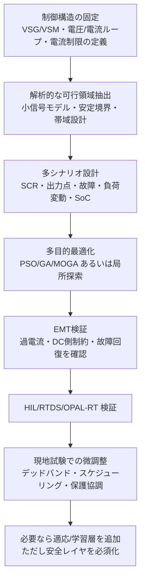

# Virtual Synchronous Generator のパラメータ最適化に関する学術研究と応用事例

## Executive Summary

VSG（Virtual Synchronous Generator）/VSM（Virtual Synchronous Machine）のパラメータ最適化研究は、初期の「慣性 \(J\) とダンピング \(D\) の手調整」から、近年は「小信号モデルに基づく解析的設計」「多運転点・多目的最適化」「容量制約を含む適応制御」「強化学習を含むデータ駆動最適化」へと明確に進化している、というのが本調査の最も重要な結論である。特に、**大きな仮想慣性を与えれば常に良い**という理解は現在では成立しない。むしろ、コンバータや系統インピーダンスを含めると、慣性の過大化は減衰比を下げ、弱系統や高次モードでは不安定化を招きうることが、2019年以降の制約解析・小擾乱解析・実験検証でかなり一貫して示されている。citeturn25view1turn13view3turn13view4

実務上の最適化対象は、もはや \(J,D\) だけではない。代表的には、P–f ループの droop 係数、電圧ループの \(K_{pv},K_{iv}\)、電流ループの \(K_{pc},K_{ic}\)、仮想インピーダンス \(R_v,L_v\)、過渡ダンピング用ハイパス経路、さらに電流制限・DC側蓄エネルギー容量・SoC 制約まで含めた**多層パラメータ最適化**が主流になりつつある。2024年のPSOベース研究では \([J,D_p,L_v,R_v,K_{pv},K_{iv},K_{pc},K_{ic}]\) を一括最適化し、複数運転点での固有値配置・減衰比・実験応答を同時に改善している。2024年の島嶼系統向け研究では、MOGA と VaR を組み合わせ、周波数応答だけでなく再エネ導入量・出力抑制・LCOE まで連成して設計している。citeturn12view2turn13view4turn46view0turn46view1turn46view3

手法面では、**解析的な安定領域の事前設定**を行わず、いきなりGA/PSO/RLだけで探索する流れは、研究としては成立しても実装としては弱い。高信頼な設計フローは、①平均化モデルや小信号モデルでパラメータ可行領域を狭め、②複数SCR・複数出力点・故障シナリオを含む多目的最適化を行い、③EMT/HIL と容量制約付きモデルで検証し、④現地試験で適応則やスケジューリングを微調整する、というハイブリッド構成になる。これは、解析設計（Wu 2016, Chen 2019）、確率・多運転点最適化（Deng 2020, Sun 2024）、容量制約付き適応制御（Chen 2022）、データ駆動最適化（Li 2021, Lu 2024）の長所を統合した構成である。citeturn34search1turn25view1turn13view4turn25view2turn26search2turn43search1

応用面では、VSG/VSMは既に実証段階を越え、グリッドフォーミングBESSやPV+ESSに実装されている。ESIG報告は、entity["country","Australia","country in Oceania"] の Dalrymple BESS が送電系接続GFM BESSとしてシームレスなアイランド形成を実証し、系統分離時に同期機に似たサブ秒の有効電力注入を示したことを記している。また、Hornsdale での virtual machine mode 試験、urlHitachi Energyturn7search0 の Lower Yorke 向けVSM事例、urlSungrowturn6search0 のSCR=1.16対応VSG機能、urlHuawei Digital Powerturn6search1 の PV+ESS グリッドフォーミング案件など、OEM資料でもVSG/VSMの実装は確認できる。ただし、**実機の最終チューニング係数は公開されないことが多く、再現性は学術研究より低い**。NREL の REGFM_B1 が vendor-specific model 不在時の汎用モデルとして提案され、NERC が実装詳細はOEM照会を推奨している事実は、この状況をよく示している。citeturn44view0turn44view1turn21view2turn21view4turn40view4turn21view0turn37view4

## 調査範囲と用語整理

本レポートは、**全期間**を対象に、日本語・英語の公開情報を優先して整理した。主たるソースは、査読論文、主要国際会議、技術報告、標準文書、博士論文相当の学術資料、OEMの公式技術資料である。重み付けは、原著論文と公式技術資料を最優先とし、レビュー論文は位置づけ整理に限定して使っている。VSG と VSM は文献上ほぼ重なって使われるが、ESIG は VSM を「スイング方程式と電圧源 behind impedance を模擬する代表的GFM方式」と整理し、NERC は GFM/GFL の定義自体が業界で未統一であると指摘する。さらに、英国のGC0137は “VSM capability” を “GB Grid Forming” に改称しており、用語の曖昧さは実務上も未解消である。citeturn37view3turn37view4turn45view0

VSGの典型モデルは、同期機のスイング方程式を模擬する能動電力ループと、AVRやQ–V droopに相当する無効電力・電圧ループから成る。NREL/UNIFI/WECC の REGFM_B1 でも、VSM GFM は「電圧源 behind impedance」として表現され、アクティブパワーループ、電圧制御、PLL相当ブロック、飽和器、基準値変更ロジックを含む構成が採られている。したがって、実際の最適化対象は、仮想慣性 \(J\) やダンピング \(D\) だけでなく、droop、フィルタ時定数、仮想インピーダンス、電圧・電流PIゲイン、位相・電圧制限器、過電流対策、蓄電池容量制約まで広がる。citeturn21view0turn40view2turn34search1turn12view2

研究潮流は大きく三段階に分けられる。初期は、日本・欧州を中心に「VSGを同期機らしく振る舞わせる」ための原理提案と安定化設計が中心だった。中期には、小信号モデル、弱系統解析、安定領域制約、過渡ダンピング設計が進み、2020年前後からは多運転点最適化、強化学習、容量制約付き適応制御、経済性連成が急速に増えた。レビュー論文も、安定性、制御次数、エネルギー貯蔵構成、適用分野、将来課題を主要テーマとして捉えている。citeturn33view1turn33view4turn33view0

## 主要論文の要約

下表は、パラメータ最適化・設計法の観点で重要度が高い論文を中心に、実務の示唆が大きいものを選んだ「上位10件相当」の要約である。近年の適応・学習型は後続節でも追加で扱う。

| 論文 | 目的 | 手法 | 主要結果 | 出典リンク |
|---|---|---|---|---|
| Sakimotoら (2015) | PLLを使わない電流制御VSGの安定設計 | 安定性解析に基づくパラメータ設計 | 同期化電力を用いてPLLなしで系統連系し、系統解列後も負荷供給可能であることをシミュレーション・実験で確認。日本発の設計論として重要。 citeturn40view2 | url原著https://doi.org/10.1541/ieejpes.135.462 |
| Alipoorら (2015) | 交番仮想慣性による高速減衰 | bang-bang型の alternating inertia | 仮想慣性をリアルタイムで切替えることで、定常周波数追従を損なわず振動減衰を高速化。過渡エネルギー解析と実験で効果を実証。 citeturn31view0turn32view0turn32view1 | url原著https://doi.org/10.1109/JESTPE.2014.2362530 |
| Wuら (2016) | VSGパワーループの体系的設計 | 平均化小信号モデル、APL/RPL分離、段階設計 | パワーループ帯域を線路周波数の2倍より十分低く取る必要、APL/RPLのデカップリング条件、段階的設計手順を提示。設計論の基礎文献。 citeturn34search1 | url原著https://doi.org/10.1109/TIE.2016.2543181 |
| Liら (2017) | 周波数安定度支援のための慣性・ダンピング協調適応 | SAIDC（Self-Adaptive Inertia and Damping Combination Control） | 既存の定数制御や慣性単独適応が見落としていたダンピングの影響を補い、周波数安定性を改善。MATLAB/Simulinkで有効性を示した。 citeturn19search1turn19search7 | url原著https://doi.org/10.1109/TEC.2016.2623982 |
| Chen & O'Donnell (2019) | 安定性を考慮した VSG パラメータ境界の導出 | 伝達関数解析とフルスイッチング検証 | 低次VSG近似が妥当な領域を定量化し、クロスオーバ周波数を同期周波数の1/10以下、かつ \(D/M\) 比を十分大きく取る制約を示した。過大慣性の危険性を明示。 citeturn18search4turn25view1turn32view2 | url原著https://doi.org/10.1109/TPWRS.2019.2896853 |
| Roldán-Pérezら (2019) | 弱系統・抵抗性/誘導性系統でのVSM設計 | 弱系統解析、仮想インピーダンスを含む設計 | 系統強度・R/X比に応じて最適設計が変わることを示し、弱系統では仮想インピーダンス設計が重要であることを明確化。 citeturn35search1turn35search10 | url原著https://doi.org/10.1109/TEC.2019.2930643 |
| Dengら (2020) | PV-VSGの多運転点ロバスト設計 | 小信号モデル + グローバル最適化 | 日射・温度変化で動作点が漂移するPV-VSGに対し、単一点最適化ではなく多動作点を考慮した設計を提案。故障時の振動を200 ms以内に抑制。 citeturn12view0turn12view1turn13view5 | url原著https://doi.org/10.3390/en13020398 |
| Xiongら (2021) | 過渡安定性を高める最適ダンピング設計 | HPFベースTDMの最適ゲイン設計 | 高域通過ダンピングのゲインは「大きければ大きいほど良い」わけではなく、過渡安定性劣化を招く可能性を示し、最適設計法を提案。 citeturn25view0 | url原著https://doi.org/10.1109/TPEL.2021.3074027 |
| Liら (2021) | モデル不要で \(J,D\) を最適化 | DRL（深層強化学習） | 専門家知識や正確モデルがなくても、仮想慣性とダンピングを行動変数として最適化可能と示した。データ駆動最適化の代表例。 citeturn25view2 | url原著https://doi.org/10.35833/MPCE.2020.000267 |
| Sunら (2024) | 単機VSGの多パラメータ同時最適化 | 固有値解析 + 多運転点PSO | \([J,D_p,L_v,R_v,K_{pv},K_{iv},K_{pc},K_{ic}]\) をPSOで同時最適化。平均65反復程度で収束し、SCR 2/8 や大外乱で過渡応答と安定性を改善。加えて「\(J\) 増加は減衰比を低下させうる」ことを実験で確認。 citeturn12view2turn13view3turn13view4 | url原著https://doi.org/10.3389/fenrg.2024.1428748 |

近年の補足として、Chenら (2022) はコンバータおよび蓄電装置の容量制約を含む適応VSGを提案し、理想DC源仮定を外した実装寄りの設計へ踏み込んだ。また、Lu & Zhuan (2024) は SAC により \(J,D\) をモデルフリー最適化し、報酬に整定時間項を入れて過度に長い過渡を避ける設計を示した。Wuら (2024) は島嶼系統で MOGA・ANN・VaR を組み合わせ、周波数 nadir と整定時間だけでなく PV 出力抑制・LCOE・許容PV導入量まで評価している。これらは実務適用により近い。citeturn43search1turn26search2turn46view0turn46view1turn46view3

## 手法比較と研究潮流

以下の比較表は、個別論文というより「設計の型」を並べたものである。実務では、単独型よりも複数型の組み合わせが有効である。

| 手法群 | 主な最適化対象パラメータ | 典型目的関数 | 典型制約条件 | 主な評価指標 | 実験/シミュレーション環境 | 利点 | 欠点 |
|---|---|---|---|---|---|---|---|
| 解析的設計・段階設計 | \(J,D,m_p,m_q\)、APL/RPLゲイン | 帯域整合、デカップリング、安定余裕 | パワーループ帯域、デカップリング条件 | 固有値、帯域、歪み、整定時間 | 平均化モデル、SMIB、実験 | 設計意図が明確、実装しやすい | モデル誤差と多運転点変動に弱い citeturn34search1turn40view2 |
| 安定領域制約設計 | 主に \(J,D\) 比、クロスオーバ周波数 | 安定領域内に留める | \(\omega_c \ll \omega_0\)、\(D/M\) 比下限 | 安定/不安定境界、伝達関数妥当性 | 伝達関数、フルスイッチング | 探索空間を安全に狭められる | 高次・非線形・モード遷移は直接扱いにくい citeturn18search4turn25view1 |
| 小信号固有値最適化 | \(J,D,R_v,L_v,K_{pv},K_{iv},K_{pc},K_{ic}\) | 固有値左方移動、減衰比最大化 | 複数運転点、所望 \(\sigma,\zeta\) | 固有値、減衰比、発散/収束 | 線形化モデル、HIL、実験 | モード別の原因が見える | 大外乱・電流制限時の妥当性が落ちる citeturn12view2turn13view3turn13view4 |
| グリッド探索/全域探索 | \(J,D\)、PIゲイン、droop | 周波数偏差最小、振動抑制 | パラメータ上下限 | 周波数 nadir、overshoot、settling | MATLAB/Simulink、PSCAD | 実装容易、説明しやすい | 次元が増えると計算量が急増 |
| GA/PSO/MOGA | 多パラメータ同時調整 | \(\Delta f_{\max}\)、整定時間、\(\int \Delta f^2 dt\)、\(\int \Delta P^2 dt\)、LCOE | 多運転点、故障時安定、確率重み | nadir、settling、導入量、LCOE | PSCAD, DIgSILENT, HIL | 多目的に強く、離散・非凸に対応 | 解析的保証が弱く、初期範囲依存が大きい citeturn30view0turn12view2turn46view0turn46view1turn46view3 |
| ロバスト/H∞/LMI | 仮想慣性・ダンピング、拡張VSG状態フィードバック | 外乱・不確かさ下で安定余裕と性能確保 | LMI可解性、構造制約 | 周波数偏差、ロバスト安定性 | マイクログリッド試験系 | モデル不確かさに比較的強い | モデル依存が強く、チューニングの直感性は低い citeturn27search1turn9search3 |
| 適応スケジューリング | \(J,D\)、過渡ダンピングゲイン、電圧/無効制御係数 | 振動のフェーズ別抑制、SCR適応 | 系統強度推定、容量境界 | power oscillation、frequency recovery | 弱系統EMT、HIL、実験 | 運転点変化・弱系統に強い | 推定誤差とノイズに敏感 citeturn11view3turn37view1turn43search1 |
| 機械学習・DRL/SAC | 主に \(J,D\)、場合により多パラメータ | 報酬最大化（\(\Delta f,\Delta P,T_s\) 等） | 行動範囲、学習安定性 | 収束、overshoot、settling | MATLAB/Simulink–Python, co-sim | モデル不要、非線形に対応 | 学習コストと安全保証が課題 citeturn25view2turn26search2turn16search1 |
| 経済性・確率連成 | PV/ESS側のVSGパラメータ、出力抑制、予備力 | nadir・settling と導入量・LCOE・リスクの同時最適化 | VaR、出力抑制、DGコスト | PV penetration、curtailment、LCOE | DIgSILENT、島嶼系統 | 導入判断に直結する | 一般系統へ外挿しにくい citeturn46view0turn46view1turn46view3 |

研究潮流を要約すると、**解析モデル → 制約付き探索 → 適応化・学習化 → 技術経済連成**という順に発展している。ただし、引用頻度や実務信頼性を見ると、現時点で最も堅いのは「小信号/伝達関数で可行領域を切り、PSO/GA/MOGAで多運転点最適化し、最後にHILや容量制約モデルで詰める」流れである。純粋なDRLは将来性が高いが、学習中の安全性・汎化・説明可能性がまだ十分ではない。citeturn25view1turn12view2turn25view2turn26search2

## 数理的要点とアルゴリズム

VSGの核は同期機スイング方程式の模擬である。代表的には次式で表される。

\[
J\omega_0 \frac{d\Delta \omega}{dt}
=
P_{\mathrm{ref}} - P_e - D\,\Delta \omega + u_{\mathrm{aux}}
\]

\[
\frac{d\delta}{dt}=\Delta \omega
\]

ここで \(J\) は仮想慣性、\(D\) はダンピング、\(\delta\) は内部位相、\(u_{\mathrm{aux}}\) は droop、過渡ダンピング、適応補償などの補助項である。Alipoorらの交番慣性法は \(J\) を状態依存で切り替え、LiらやShiらの適応法は \(J,D\) を振動位相や power-angle curve に応じて更新する。SunらのPSO研究やDengらのPV-VSG研究では、このループに電圧・電流ループや仮想インピーダンスを重ねた状態空間モデルを作り、固有値または時間応答を最適化している。citeturn31view0turn11view3turn12view2turn13view5

実務的な最適化問題は、概ね次のように書ける。

\[
\min_{\theta \in \Theta}
F(\theta)
=
w_f \int_0^T \Delta f(t)^2\,dt
+
w_p \int_0^T \Delta P(t)^2\,dt
+
w_s T_s
+
w_o M_p
\]

subject to

\[
\lambda(A_j(\theta)) \in \mathbb{C}_{-}, \quad
i_{\mathrm{conv}}(t)\le i_{\max}, \quad
E_{\mathrm{dc}} \in [E_{\min},E_{\max}], \quad
\theta_{\min}\le \theta \le \theta_{\max}
\]

ここで \(\theta\) は最適化対象パラメータ集合であり、\(J,D,m_p,m_q,R_v,L_v,K_{pv},K_{iv},K_{pc},K_{ic}\) などを含む。Dengらは多運転点のグローバル最適化を行い、Sunらは固有値の実部と減衰比を組み込んだ目的関数を複数運転点の確率重み付きに拡張している。Wuら (2024) はさらに \(\Delta f_{\max}\) と整定時間 \(T_s\) をMOGAで同時最適化し、その上にANNベース出力抑制制御とLCOE評価を重ねている。citeturn12view2turn13view5turn46view0turn46view1turn46view3

小信号設計の要点は二つある。第一に、Wuらが示したように、VSGのパワーループ帯域は高すぎると出力電圧歪みを招くため、線路周波数近傍より十分低く設計する必要がある。第二に、Chen & O'Donnell が示したように、コンバータと線路ダイナミクスを含めると \(J,D\) は任意に大きく取れず、低次近似が妥当な範囲に留める必要がある。これは「VSGは同期機と同じ式だから同期機の定石で良い」という設計を否定する重要知見である。citeturn34search1turn18search4turn25view1

強化学習ベース最適化は、状態 \(s_t=[\Delta f_t, P_t, \ldots]\)、行動 \(a_t=[\Delta J_t,\Delta D_t]\) とし、報酬を

\[
r_t = -\alpha |\Delta f_t| - \beta |\Delta P_t| - \gamma T_{\mathrm{settle}}
\]

のように定義する構成が典型である。Liら (2021) は仮想慣性とダンピングを直接 action とするDRLを提案し、Lu & Zhuan (2024) は整定時間項を明示的に報酬へ入れたSACを使って過度に遅い応答を避けている。学術的には非常に有望だが、現場適用では「探索時の安全性」と「訓練分布外での汎化」が未解決である。citeturn25view2turn26search2

実務向けには、次のハイブリッド・ワークフローが最も妥当である。これは本調査で最も推奨したい手順である。citeturn25view1turn12view2turn21view0turn37view4

## 応用事例と実装課題

公開OEM資料と業界レポートから確認できる応用事例を、VSG/VSM機能が明示されたもの中心に整理すると次のようになる。

| 応用事例 | 公開された機能・確認事項 | パラメータ最適化への示唆 |
|---|---|---|
| Dalrymple BESS（entity["country","Australia","country in Oceania"]） | ESIGは、Dalrymple を送電系接続GFM BESSとして紹介し、30 MW/8 MWh、2018年商用開始、シームレスなアイランド形成、電圧ディップ回避、アイランド時の周波数帯維持、系統分離時のサブ秒有効電力注入を報告している。citeturn44view0 | アプリケーションの主眼は「安定余裕」だけでなく、**アイランド形成・周波数維持・電流供給・復帰シーケンス**全体最適化にある。 |
| Hornsdale試験（entity["country","Australia","country in Oceania"]） | ESIGは、VMMを試験中の2台のGFMインバータが発電機脱落時にイベント開始直後から固有の active power injection を示したと報告している。citeturn44view1 | 慣性・ダンピングの最適化は、単なる定常droopではなく**サブ秒の固有応答**設計が鍵。 |
| Lower Yorke 向けVSM（entity["country","Australia","country in Oceania"]） | urlHitachi Energyturn7search0 の資料では、エネルギー貯蔵を伴うVSMにより電力系統を安定化し、地域をシームレスにアイランド化して風力活用と信頼性向上を図る事例が示されている。citeturn21view2 | 保護・自立運転・風力協調まで含めた**モード遷移最適化**が必要。 |
| Waratah Super Battery（entity["country","Australia","country in Oceania"]） | 同じく urlHitachi Energyturn7search0 の資料では 850 MW/1680 MWh、288 PCS で系統の “shock absorber” として信頼性を改善する構成が示される。citeturn21view2 | 大規模運用では個別VSG最適化より、**多数PCSの協調パラメータ設計**が本質になる。 |
| SG320HX（entity["country","China","country in East Asia"] のOEM資料） | urlSungrowturn6search0 の白書では、SCR=1.16の弱系統での安定動作、30 ms の無効電力応答、VSG機能の統合が明記されている。citeturn21view4turn22view2 | ここでは \(J,D\) よりも **弱系統インピーダンス適応、過渡過電圧抑制、Q応答速度** が実務制約になる。 |
| Smart String Grid-Forming PV+ESS（entity["country","Cambodia","country in Southeast Asia"]、entity["country","Saudi Arabia","country in the Middle East"] ほか） | urlHuawei Digital Powerturn6search1 は、VSG特性、慣性応答、一次周波数制御、短絡容量、振動減衰、black start、on/off-grid切替を備えたPV+ESSグリッドフォーミングを説明し、カンボジア12 MWh案件や Red Sea マイクログリッドを紹介している。citeturn40view4 | PV+ESSでは**出力抑制・予備力配分・PCS協調**を含めたパラメータ最適化が必要で、単独インバータ設計では足りない。 |

これらの事例から、実装上の課題は少なくとも六つに整理できる。第一は**計算負荷**である。PSOやMOGAは多シナリオ・高次モデルでは高価であり、DRLはオフライン学習にさらに大きいコストがかかる。そのため、オンライン最適化は基本的に避け、オンラインではパラメータスケジューリングまたは小規模な補正に留めるのが安全である。SunらのPSOが約65反復で収束したことは有望だが、それでも現地実運用の秒オーダ再最適化とは別物である。citeturn12view2turn13view4turn25view2turn26search2

第二は**測定ノイズと遅れ**である。これは公開論文で明示的に主題化されることは少ないが、VSGは本質的に出力電力、周波数、場合によってはPLL・RoCoF・PCC電圧を状態として用いる。NRELモデルでも PLL、周波数凍結、フィルタ、飽和器が組み込まれており、Lu & Zhuan のSACも active power と frequency response を状態入力にしている。したがって、フィルタでノイズを抑えると遅れが増え、遅れを減らすと適応則がノイズを増幅する、というトレードオフが避けられない。設計上の推論としては、**高周波ノイズに敏感なRoCoF直結適応より、帯域制限した状態量と明示的デッドバンドを用いる方が安全**である。citeturn21view0turn26search2turn40view2

第三は**モデル不確かさと弱系統依存性**である。Roldán-Pérezら、Sunら、Frontiers 2024 の可変パラメータ型研究はいずれも、SCRやR/X比によって望ましいパラメータが変わることを示している。特に Frontiers 2024 では、SCR 15→5→1.2 に変化しても overshoot を 10%未満に抑える調整戦略を示している。したがって、単一の固定チューニング値を「製品標準」として広い案件へ移植するのは危険で、**SCR・短絡容量・抵抗性の程度を入力にしたパラメータスケジューリング**が現実的である。citeturn35search1turn37view1turn13view4

第四は**ハードウェア制約**である。VSGはしばしば同期機に似た挙動を目指すが、実機は電流上限・DCリンク・蓄電池出力/エネルギー上限を持つ。Chenら (2022) は converter and storage capacity limits を含む適応VSGを提案しており、NRELの過電流制限レビューも current limiting がデバイス安定性・保護・故障回復へ強い影響を持つことを強調する。2025年のレビューでも、VSGの異常時過電流問題は未解決と指摘されている。実装では、**最適化問題の制約に \(i_{\max}\)、DC側エネルギー、SoC、fault recovery を必ず含める**べきである。citeturn43search1turn42search9turn42search5

第五は**スケーラビリティ**である。単機VSGではうまくいく調整が、多並列VSGでは相互作用モードを悪化させることがある。2025年レビューは、多重VSGが並列運転すると振動・不安定化が起きやすいと整理している。Waratah級の多数PCS案件では、この問題はより深刻になる。よって今後の実務では、単機最適化だけでなく、**クラスタ単位の協調最適化**と、上位EMS/AGCとの役割分担設計が要る。citeturn42search18turn21view2

第六は**OEM依存性**である。NRELの REGFM_B1 は、vendor-specific model が無い長期計画解析向けに設計されている。NERCも実設置GFM/GFLの詳細はOEMに確認すべきだとしている。すなわち、研究者が論文から得る「最適パラメータ」は、現実には製品固有実装、保護ロジック、フィルタ、飽和器、故障モードで大きく変わる。最適化研究を導入する際は、**論文パラメータの値そのものではなく、最適化の考え方と制約構造を移植する**のが正しい。citeturn21view0turn37view4

## ベンチマーク・再現性・推奨ワークフロー

再現性の観点では、VSG分野はまだ成熟していない。NERC はGFM/GFL定義が未統一とし、英国GC0137は VSM という語を GB Grid Forming に改めている。標準化提案論文も、2020年時点でVSGベースインバータには統一規格がなく、同期機・ディーゼル発電機の既存標準を参照して試験項目を提案している。つまり、**共通の単一ベンチマークや単一評価データセットは現時点で存在しない**。citeturn37view4turn45view0turn23search12

ただし、使うべき“共通土台”は見え始めている。第一に、entity["organization","National Renewable Energy Laboratory","U.S. research laboratory"]、entity["organization","Western Electricity Coordinating Council","North American power system organization"]、EPRI、GE、Siemens らが関与した REGFM_B1 は、VSM型GFMの計画解析向け標準モデルとして非常に有用である。第二に、ESIG報告はラボ試験・シミュレーション・実系統イベントの見方を整理しており、Dalrymple/Hornsdaleの実例まで含む。第三に、entity["country","United Kingdom","country in Europe"] の GC0137 と、entity["country","China","country in East Asia"] の GB/T 38983.1-2020 は、少なくとも用語・能力要件・コンプライアンスの枠組みを与える。citeturn21view0turn44view3turn45view0turn45view1

公開論文の再現性はばらつきが大きい。IET 2024 はデータを “reasonable request” で提供可能とし、Frontiers 2024 も raw data を著者が提供するとしている一方、コードやHIL設定、per-unit基底、飽和器条件、保護ロジックまで開示する研究はまだ少ない。したがって、追試に必要なのは「論文中の最適パラメータ表」ではなく、**制御ブロック図、規格化基底、フィルタ時定数、制約、試験シナリオ表**である。citeturn11view3turn13view4

実務者・研究者向けの推奨手順は次のとおりである。まず、SMIB または最小マイクログリッドの平均化モデルでパラメータ領域を解析的に切る。次に、EMTモデルへ昇格し、SCR、負荷変動、三相短絡、発電機脱落、モード遷移、電流制限、SoC を含むシナリオ表を作る。続いて、PSO/GA/MOGA 等で目的関数を評価し、その後 HIL で遅れ・量子化・保護ロジックを検証する。最後に、現地試験では固定パラメータで初期立上げを行い、適応や学習は必ず安全レイヤと上限制約の内側でのみ有効化する。これは研究と実装の乖離を最も小さくする。citeturn25view1turn12view2turn46view1turn21view0turn42search9

### Open questions / limitations

本調査で高信頼に確認できたのは、「傾向」「制約」「代表手法」「実証事例」であり、OEM実機の最終チューニング値そのものではない。公開資料には、正確な現地パラメータ、保護協調ロジック、内蔵フィルタ時定数、SoC戦略、並列機間の上位協調ロジックが欠ける場合が多い。また、機械学習型手法は有望だが、訓練データ、分布外事象、サイバー・安全保証まで含めた評価はまだ不十分である。citeturn21view0turn37view4turn15search7

## 研究課題と実用化への提言

短期・中期・長期で何を優先すべきかを、VSG最適化の成熟度に沿って整理すると次のようになる。

| 時間軸 | 優先課題 | 提言 |
|---|---|---|
| 短期 | 解析境界と多運転点最適化の統合 | まず \(J,D\) の安定領域、帯域制約、電流上限制約を切り、その内部でPSO/GA/MOGAを使う。論文・社内設計書には **parameter bounds, per-unit base, scenario matrix** を必ず明記する。 citeturn25view1turn34search1turn12view2 |
| 中期 | 系統強度・SoC・運転モードに応じたパラメータスケジューリング | 弱系統対応や islanding/black-start では固定値よりスケジューリングが有利。SCR推定と容量制約を入力とする gain scheduling を標準化する。 citeturn37view1turn43search1turn44view0 |
| 中期 | 技術経済連成 | 島嶼系統やPV+ESSでは、周波数だけでなく curtailment、導入量、LCOE、リスク許容度を同時最適化する。特に pre-curtailment は制御問題であると同時に事業性問題でもある。 citeturn46view0turn46view1turn46view3 |
| 長期 | 多機協調と相互運用性 | 多数PCSや多サイトGFMでは、単機最適化ではなく fleet-level coordination と通信断耐性が必要。標準モデル・標準試験・標準定義の整備を進める。 citeturn42search18turn45view0turn45view1turn37view4 |
| 長期 | 学習型最適化の安全化 | DRL/SACを現場で使うには、action clipping、制約投影、safe policy、OEM保護との整合が要る。学習器は“本制御”ではなく“補助最適化層”として使うのが現実的。 citeturn25view2turn26search2 |

総合的に見ると、VSGパラメータ最適化の実務上の最適解は「万能な一組の係数」ではない。最も再現性が高く、現場移植性が高いのは、**安定境界つきの多シナリオ多目的最適化**をベースにし、弱系統・容量制約・保護協調・経済性を段階的に追加する設計である。研究として新しいのは学習型手法だが、実用上いま最も価値が高いのは、解析型・探索型・適応型を組み合わせた安全重視のハイブリッド設計である。citeturn25view1turn12view2turn43search1turn46view3

### 参考にした主要ソース

- urlSakimotoら 2015 IEEJ 論文https://doi.org/10.1541/ieejpes.135.462 citeturn40view2  
- urlAlipoorら 2015 JESTPE 論文https://doi.org/10.1109/JESTPE.2014.2362530 citeturn31view0turn32view0  
- urlWuら 2016 TIE 論文https://doi.org/10.1109/TIE.2016.2543181 citeturn34search1  
- urlLiら 2017 TEC 論文https://doi.org/10.1109/TEC.2016.2623982 citeturn19search1turn19search7  
- urlChen & O'Donnell 2019 TPWRS 論文https://doi.org/10.1109/TPWRS.2019.2896853 citeturn25view1turn18search4  
- urlRoldán-Pérezら 2019 TEC 論文https://doi.org/10.1109/TEC.2019.2930643 citeturn35search1turn35search10  
- urlDengら 2020 Energies 論文https://doi.org/10.3390/en13020398 citeturn10search0turn13view5  
- urlXiongら 2021 TPEL 論文https://doi.org/10.1109/TPEL.2021.3074027 citeturn25view0  
- urlLiら 2021 JMPCE 論文https://doi.org/10.35833/MPCE.2020.000267 citeturn25view2  
- urlChenら 2022 CSEE JPES 論文https://doi.org/10.17775/CSEEJPES.2019.03360 citeturn43search1  
- urlSunら 2024 Frontiers 論文https://doi.org/10.3389/fenrg.2024.1428748 citeturn11view2turn13view4  
- urlLu & Zhuan 2024 Sensors 論文https://doi.org/10.3390/s24072035 citeturn26search1turn26search2  
- urlWuら 2024 Frontiers 論文https://doi.org/10.3389/fenrg.2024.1460940 citeturn46view0turn46view1turn46view3  
- urlNREL REGFM_B1 技術報告turn20search1 citeturn21view0  
- urlESIG Grid-Forming Technology in Energy Systems Integrationturn14search16 citeturn37view3turn44view0turn44view1  
- urlNERC Grid Forming Controls White Paperturn23search20 citeturn37view4  
- url英国 GC0137 Grid Forming Capability 報告turn23search4 citeturn45view0  
- url中国 GB/T 38983.1-2020 標準ページturn23search18 citeturn45view1  
- urlHitachi Energy 公式資料turn8search2 citeturn21view2  
- urlSungrow Grid Forming White Paperturn6search4 citeturn21view4turn22view2  
- urlHuawei Digital Power 公式技術ブログturn6search1 citeturn40view4