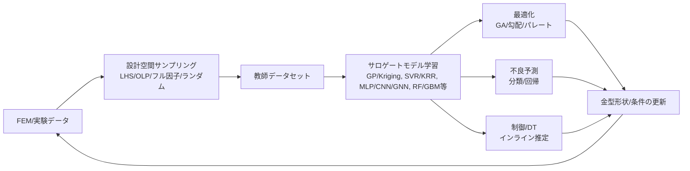
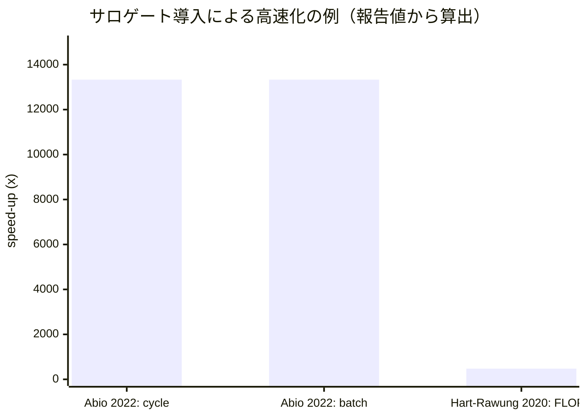

# 金型プレス加工における機械学習サロゲートモデル研究動向

## エグゼクティブサマリ

金型プレス加工（主に板材プレス／深絞り／ホットスタンピング等）での機械学習（ML）サロゲートモデルは、**高価なFEM/CAEを置き換える近似モデル**として、過去15年で「最適化・ロバスト設計」「不良予測（割れ・しわ・スプリングバック等）」「インライン制御／デジタルツイン」「形状・場（厚み分布等）の高速推定」へ用途が拡大してきました。citeturn4view0turn15view0turn23view3turn18view3turn27view0

主要な査読論文群からは、次の傾向が読み取れます。

学習データの多くはFEMシミュレーション生成で、設計空間の取り方が性能を左右します。例えば、entity["people","A. Abio","materials 2022 author"]らは、データ数を単純に増やすよりも**状態空間を広くカバーする（偏りを抑える）**方が汎化に効くこと、また学習用シミュレーション生成コストが大きいことを具体的に示しています（例：サイクル生成の推論時間を~3×10^-3 sにし、FEMの~40 sから“4桁”高速化）。citeturn14view0turn14view1

モデル種別としては、  
- **低次元入力→低次元出力**（例：最大スプリングバック量、最大薄肉化、品質指標など）では **GP/Kriging・MLP・SVR/KRR** が堅調、  
- **分類（不良の有無）**では **アンサンブル（RF/GBM、スタッキング）** が安定、  
- **高次元形状・場の推定（厚み分布、最終形状など）**では **CNN/GNN/点群ネット**等の深層学習が実装される、  
という住み分けが見えます。citeturn23view3turn18view3turn20view2turn27view0turn33search1

物理モデルとのハイブリッド（「FEM全置換」ではなく、**FEMの一部サブモデルをMLに置換**、あるいは**実験＋シミュレーションのマルチフィデリティ**）は、実運用に近い筋の良いアプローチとして複数報告があります（例：ホットスタンプの相変態計算をMLサロゲートに置換、シミュレーション内の割合が大きい処理を削減）。citeturn4view3turn4view6

日本語ソースとしては、査読論文に限定するとオンラインでの即時同定が十分ではありませんでした。一方、**国内学会発表・産業系資料**では、金型形状—解析結果形状の関係を学習し、平均誤差0.3 mm程度を報告する例や、サロゲートモデルでCAE業務を効率化する解説記事の書誌が確認できます。citeturn33search1turn33search3turn3view0

特許については、J-PlatPat／Espacenet上で「プレス成形×機械学習×サロゲートモデル」を明示する公報を、この短いオンライン探索だけで網羅的に収集することはできませんでした（検索語・分類の深掘りが必要）。ただし「スプリングバック補正のための“surrogate die”」など、**“サロゲート”概念自体を金型修正に用いる**公報は確認できます。citeturn34search13turn34search17

## 調査範囲と方法

調査対象は2011年以降を中心に、板材プレス（深絞り、しわ／割れ、スプリングバック、VBHF、ドロービード等）およびホットスタンピング（プレスハードニング）を含め、機械学習を用いてFEM/CAEの代替・近似（回帰／分類／場予測）を行う論文・会議・産業資料を優先しました。citeturn4view0turn15view0turn23view3turn18view3turn14view1

ScopusやWeb of Science等の商用データベースは、ここでは直接クエリできないため、出版社ページ、arXiv、オープンアクセスPDF、会議アブストラクト等の一次情報に基づき、**「確認できた範囲」で項目を埋め、不明は不明として明記**しています。citeturn21view0turn19view0turn31view0turn33search1

image_group{"layout":"carousel","aspect_ratio":"16:9","query":["deep drawing sheet metal forming blank holder force","sheet metal forming springback compensation die","drawbead sheet metal forming fender","hot stamping press hardening die"],"num_per_query":1}

## 収集論文・資料一覧

### 主要文献一覧

下表は、金型プレス加工に直結し、かつサロゲートモデル（回帰／分類／最適化・制御への組込み）としての記載が明確なものを中心に整理しています。

| 文献 | 問題設定 | サロゲートモデル種 | 備考（位置づけ） |
|---|---|---|---|
| entity["people","S. Kitayama","ijamt 2012 author"] (2012) | 深絞り（Square cup）のVBHF軌道最適化（薄肉化偏差最小、しわ・割れ制約）citeturn4view0 | RBFネット（SAO）citeturn4view0 | 2010年代前半の「近似最適化」代表例 |
| entity["people","M. E. Palmieri","metals 2021 author"] (2021) | 自動車部品深絞りのロバスト最適化：BHF調整曲線（ノイズ：降伏応力・摩擦）citeturn15view0turn16view3 | Kriging（DACE）citeturn15view1 | AutoForm + Kriging + 多目的最適化で「規制曲線」生成 |
| entity["people","A. E. Marques","metals 2020 author"] (2020) | 不確かさ解析（U-Channel & Square Cup）のメタモデリング手法比較citeturn21view0turn23view3 | RSM, PCE, GP, MLP, SVR, KRR, DT, RF, kNNciteturn21view0turn23view3 | “どのサロゲートが効くか”を定量比較した基盤文献 |
| entity["people","M. A. Dib","nca 2019 author"] (2019) | ばらつき下での不良（スプリングバック/最大薄肉化/最大塑性ひずみ等）発生予測（分類）citeturn19view0turn20view3 | 単体分類器 + アンサンブル（多数決/スタッキング）citeturn20view2 | 「不良の有無」分類の体系的ベンチ |
| entity["people","T. Trzepieciński","materials 2020 author"] (2020) | 引張試験パラメータからスプリングバック予測（冷延鋼、異方性）citeturn3view3 | MLP + GA（入力選択）citeturn3view3 | 実験由来入力でのスプリングバック推定 |
| entity["people","A. Abio","materials 2022 author"] (2022) | プレスハードニング（22MnB5）で温度など主要状態量をサロゲートで高速予測（Industry 4.0/DT想定）citeturn14view1turn14view0 | XGBoost回帰（候補比較あり）citeturn14view2 | 推論を“ソフトリアルタイム”へ、学習生成コストも明示 |
| entity["people","X. Guo","pmc 2024 author"] (2024) | スタンピングでVBHF軌道を最適化し、破断・しわ・スプリングバック同時低減citeturn5view3 | DNNサロゲート + GA + MCSciteturn5view0turn5view3 | 多目的（複数欠陥）＋確率要素を組み合わせ |
| entity["people","S. Yi","applsci 2025 author"] (2025) | ドロービード位置/拘束力変化に対する「割れ・しわ」リアルタイム予測（DT + GUI）citeturn18view3turn18view1 | SVM / RF / GBM / ANNciteturn18view2turn18view3 | FEデータ256ケースでモデル比較、GUI化まで |
| entity["people","M. E. Palmieri","jmmp 2023 author"] (2023) | インライン計測（ドローイン）から摩擦係数推定→最適BHFを計算しインライン調整citeturn17view2turn17view0 | Kriging（µ=f(draw-in), BHF=f(µ)）citeturn17view0turn17view2 | 「制御に載せる」ことを前提に時間制約まで言及 |
| entity["people","M.-G. Kim","materials 2025 author"] (2025) | VCM（被覆鋼板）スタンピングで剥離・しわを同時最小化（DNN + Pareto）citeturn8view0turn12view2 | DNN回帰（2出力）citeturn8view0turn12view0 | 108FEケース→設計空間3696点を高速評価 |
| entity["people","H. R. Attar","engappai 2023 author"] (2023) | SDF幾何＋画像ベース製造性サロゲートで3D形状を勾配法で最適化（薄肉化制約）citeturn27view0turn30search3 | NN（幾何生成 + surro）citeturn27view0 | 複雑形状（非パラメトリック）へ拡張 |
| entity["people","H. Zhou","arxiv 2022 author"] (2022, preprint) | ホットスタンプのブランク形状最適化を“微分可能サロゲート”で自動化citeturn4view5turn31view0 | CNN系サロゲート + 勾配最適化（記載範囲）citeturn4view5 | 形状最適化の“手戻り2週間”問題へのアプローチ |
| entity["people","H. K. Hart-Rawung","procedia 2020 author"] (2020) | ホットスタンプで相変態モデルをMLサロゲートに置換し計算短縮citeturn4view3 | ML回帰（相分率予測）citeturn4view3 | FEM内の重いサブ計算を置き換えるハイブリッド |
| entity["organization","福岡県工業技術センター","fukuoka, jp"] (産業技術報告) | CAE回数低減のスプリングバック見込み設計ツール（回帰＋最適化）citeturn3view0 | 回帰（手法詳細は報告内）citeturn3view0 | 日本語の実務寄り事例（査読論文ではない可能性） |
| entity["organization","人工知能学会全国大会","jsai annual conference"] (2025) | プレス成形FEM結果を対象に金型形状→製品形状を学習し数分推論、平均誤差0.3mm程度citeturn33search1turn33search6 | 3D点群モデル（PointNeXt応用）citeturn33search1 | 国内学会（論文PDFは要ログインのため詳細未確認） |

## 各文献ごとの詳細サマリ

要求項目（入力特徴量・出力、データ規模、性能数値、計算コスト、再現性、産業適用など）を、**一次情報で確認できた範囲**で埋めます。確認できない項目は「記載なし／不明」としました。

| 文献 | 入力特徴量 → 出力 | データセット（規模・取得） | 性能指標と数値 | 計算コスト・推論時間 | 実装上の課題・利点 | 再現性・産業適用 |
|---|---|---|---|---|---|---|
| Kitayama 2012 | VBHF軌道（設計変数）→ 厚み偏差（目的）＋ FLD制約（しわ/割れ）citeturn4view0 |（記載なし：抽象からは規模不明）FEMを想定citeturn4view0 |（記載なし） |（記載なし） | SAO＋RBFで最適化を回しやすいciteturn4view0 | コード/データ公開：不明（出版社購読範囲外） |
| Palmieri 2021 | 摩擦係数・降伏応力（ノイズ）＋プロセス条件 → 品質指標（安全域、割れ/しわ傾向、薄肉化等）citeturn15view1turn16view3 | AutoForm SigmaでLHSサンプリング、**81回の数値解析**citeturn16view3 |（サロゲート精度指標そのものは本文中で明示確認できず） | 「リアルタイム制御に利用可能な規制曲線」を志向citeturn15view0（推論時間数値は記載抽出できず） | Krigingは補間性が高く多目的最適化に接続しやすいciteturn15view1turn15view0 | Data availability: “Not applicable”citeturn15view2（産業ケース：車体部品）citeturn15view0 |
| Marques 2020 | 材料特性（E, ν、硬化則係数等）、板厚、摩擦係数、BHF等 → 最大薄肉化、スプリングバック（U-Channel）、最大相当塑性ひずみ（Square Cup）citeturn23view3turn21view0 | 各材質で入力を正規分布とし**1000点生成→各プロセスで計3000FEM**、訓練700/テスト300citeturn23view3 | 指標：RMSRE(%)。例：U-Channel(スプリングバック)でMLP 1.986、GP 2.132等／DTやkNNは悪化傾向など（Table2）citeturn23view3 |（推論時間は明示確認できず） | 多手法比較により、問題ごとの“効くモデル”を示す（最大薄肉化ではGPが良い等の結論言及）citeturn21view0turn22view0 | 実装：Excel（RSM/PCE）＋Python（GPy/Scikit-learn）citeturn23view3、コード公開は不明 |
| Dib 2019 | 11入力（材料特性＋板厚＋プロセス条件）→ 欠陥の有無（2値分類）citeturn19view0turn3view2 | 数値シミュレーションでデータ生成。サンプル数を200→2000で増やし性能変化も評価citeturn20view3 | 指標：F-score（＋AUC）。例：単体分類器でF-scoreが約79.85–93.63%レンジ等citeturn20view3。アンサンブル（多数決/スタッキング）ではF-score~83–93%台、AUC~87–96%台（Table4-5）citeturn20view2 |（推論時間記載なし） | サンプル数増でF-score上昇傾向、スタッキングが概ね有利citeturn20view2turn20view3 | 産業適用示唆（欠陥削減の意思決定支援）citeturn19view0turn20view2、データ公開は不明 |
| Trzepieciński 2020 | 引張試験で得た材料パラメータ → スプリングバック係数Ksciteturn3view3 | 実験由来（引張試験）＋予測モデル（規模は本文確認できず）citeturn3view3 |（本文数値未抽出：要追加確認） |（記載なし） | GAで入力選択を行いMLPを訓練citeturn3view3 | データ/コード公開：不明 |
| Abio 2022 | 入力（プロセス変数＋時系列窓の有無など）→ 温度等の主要状態量（回帰）citeturn14view2turn13view0 | FEシミュレーションのバッチ・サイクルで学習。最終モデルは**220バッチ×10サイクル**へ最適化citeturn13view0turn13view1 | “MAE≈3°C”程度で妥当と記載citeturn14view1 | Table9：Simulation サイクル~40s/バッチ~2000s、Surrogate サイクル~3e-3s/バッチ~1.5e-1sciteturn14view0 | データ偏り（定常域への偏り）で汎化が悪化し得る、適切なカバレッジが重要citeturn13view0turn13view1 | 産業（自動車ホットスタンプ）とDT/RL活用を明確に想定citeturn13view1、コード/データ公開は不明 |
| Guo 2024 | VBHF軌道等（設計変数）→ 破断/しわ/スプリングバック等の欠陥指標（多目的）citeturn5view0turn5view3 |（データ規模未抽出：本文中にある可能性） | 平均学習集合に対して、破断18.89%、しわ13.59%、スプリングバック14.26%改善等citeturn5view3 |（推論時間記載未抽出） | DNNサロゲート＋GA＋MCSで「複数欠陥」「確率性」を同時に扱う構成citeturn5view0turn5view3 | PMC公開（再現性は比較的高いがコード公開は不明）citeturn5view3 |
| Yi 2025 | ドロービード位置＋拘束力など8設計パラメータ（3水準等）→ しわ/割れ（分類＋回帰）citeturn18view3 | OLP（LHS派生）でケース削減し**256解析**citeturn18view3 | Table3：Crack classifierは全モデル100%。回帰MSE：WrinkleはGBM 0.141が最良、CrackはRF 0.038が最良等citeturn18view3 |（リアルタイムGUIを主張、ms級等の明示は未確認）citeturn18view1turn18view3 | GBM/RFが非線形・交互作用に強いという説明と一致する結果citeturn18view1turn18view3 | GUIを構築し現場利用を意識citeturn18view1turn18view3、コード/データ公開は不明 |
| Palmieri 2023 | draw-in(A,B,C) → 摩擦係数推定、摩擦係数 → BHFopt推定（Kriging）citeturn17view0turn17view2 | 数値計画：摩擦係数0.05–0.15（0.02刻み）などを明示、BHFも別計画で走査citeturn17view2（総数は未抽出） | 摩擦係数推定の平均誤差4%citeturn17view2 | インライン実装に向け、待ち時間~1 sや調整猶予tcを議論citeturn17view2 | 「計測→推定→一度だけBHF調整」でPID反復を回避する意図citeturn17view2turn5view1 | 実験（レーザ三角測量センサ等）でシステム性確認citeturn5view1、データ公開なしciteturn5view1 |
| Kim 2025 | 4設計変数（ブランク形状・輪郭オフセット・クリアランス・パンチR）→ 剥離指標Fd・しわ指標Fwciteturn8view0turn12view3 | FEで**108ケース（フル因子）**、80/10/10分割citeturn8view0turn12view3。学習後、設計空間**3696組合せ**を推定citeturn8view0turn12view3 | Test誤差：MAE 0.027、RMSE 0.044、R^2 0.954citeturn12view0turn12view2。FEとDNNの比較（2点）で誤差~0.37–3.7%などciteturn12view1 |（推論時間の絶対値は未記載。ただし“反復FE不要”を主張）citeturn8view0turn12view1 | 小規模FE（108）に対して非常に大きいDNN（5層×1000）を採用し、早期停止で過学習回避を記述citeturn8view0turn12view1 | Data availability記載は本文末（抽出範囲外で未確認）。少なくとも“最適条件をFEで検証”まで実施citeturn10view1turn12view1 |
| Attar 2023 | SDF表現の幾何（入力は潜在変数等）→ 製造性（薄肉化など）分布をサロゲートで評価citeturn27view0 | 2形状クラス×複数サブクラス、ケーススタディ4件（データ規模は未抽出）citeturn27view0 | 例：最大薄肉化を45%から、制約10%を満たす方向へ改善と記載citeturn27view0 |（推論時間の数値は未記載） | 「非パラメトリック形状」をサロゲート＋勾配最適化で扱う点が特徴citeturn27view0 | Data availability：合理的要請で提供citeturn27view0 |
| Zhou 2022 preprint | ブランク形状パラメータ→最大薄肉/厚肉など製造性指標を微分可能サロゲートで即時推定し最適化citeturn4view5 |（データ規模未抽出） | 工業基準例として薄肉/厚肉の閾値0.15/0.1等の記述citeturn4view5 | “real-time”推定を目標、手作業最適化が通常2週間という現場課題を説明citeturn4view5 | 勾配最適化に載せるため“微分可能”を強調citeturn4view5 | arXiv（コード/データリンクは本抽出範囲では未確認）citeturn31view0 |
| Hart‑Rawung 2020 | 変形・冷却履歴→最終相分率（相変態）をMLで推定し、FEM内計算を置換citeturn4view3 | LS-DYNAで条件を変えたシミュレーション群を学習データ化citeturn4view3 | 相分率予測が“well”と記述、加えてFLOPS削減を指標化citeturn4view3 | FLOPS指標：5713→12へ削減（≈476×）citeturn4view3 | FEM全置換でなく「重い部分置換」は実装・検証がしやすいciteturn4view3 | オープンアクセス（CC BY-NC-ND）と明示citeturn4view3（コード公開は不明） |
| 福岡県工業技術センター報告 | 多数のプレスCAEデータベース＋回帰＋最適化でスプリングバック見込み設計citeturn3view0 | “多数”CAE結果DB（規模数値は未抽出）citeturn3view0 | 回帰計算のスプリングバック結果とCAE差が1.6 mmと記載citeturn3view0 | CAE回数低減が主目的citeturn3view0 | 実製品（タンクナックル部材）を題材にした実務寄りciteturn3view0 | 公的機関の成果報告（査読論文かは不明）citeturn3view0 |
| 人工知能学会全国大会 2025 | 金型形状（点群特徴）→プレス品形状を学習し、推論は数分・平均誤差0.3mm程度citeturn33search1turn33search6 |（講演PDFは要ログインのため詳細不明） | 平均誤差0.3mm程度と記載citeturn33search1 | 推論が数分で可能と記載citeturn33search1 | PointNeXtを形状学習に応用citeturn33search1 | 国内発表（査読付き論文としての公開形態は未確認）citeturn33search1 |

## 手法別の比較分析

### サロゲートの使い方の類型

文献を「サロゲートをどこに差し込むか」で整理すると、実装上の要件がはっきりします。



この“ループ”は、(i) VBHF最適化（SAO/RBF）citeturn4view0、(ii) Kriging + 多目的最適化で規制曲線生成citeturn15view0turn16view3、(iii) 微分可能サロゲートでブランク形状を勾配最適化citeturn4view5turn27view0、(iv) デジタルツインでGUI化し現場入力→出力推定citeturn18view3turn18view1、といった形で具体化されています。

### 手法別の性能傾向

**回帰（低次元）**  
大規模な比較が明示されているentity["people","A. E. Marques","metals 2020 author"]らの結果では、RMSRE（%）で評価したとき、**GP/MLP/SVR/KRR/PCE**が相対的に良いケースが多く、DTやkNNは悪化しやすい傾向が読み取れます（Table2）。citeturn21view0turn23view3  
同論文は、材料が複数でも混在データセットで学習して性能が大きく悪化しない場合があることも述べています。citeturn22view0turn23view3

**分類（不良の有無）**  
entity["people","M. A. Dib","nca 2019 author"]らは、サンプル数を増やすとF-scoreが上がる一般傾向を示したうえで、アンサンブル（多数決、特にスタッキング）が高いF-score/AUCと低分散を示すことを報告しています。citeturn20view2turn20view3  
同時に、違いが小さい条件もあり、「分類だけで現場の意思決定に十分か」は、実データ検証が残る、と読むのが堅実です（論文自身が産業適用は“期待”としている）。citeturn19view0turn20view2

**アンサンブル木（RF/GBM）**  
entity["people","S. Yi","applsci 2025 author"]らのドロービード問題では、回帰MSEがSVMやANNよりRF/GBMの方が小さい結果が表で示されています。citeturn18view3turn18view1  
一方で、全モデルで割れ分類100%など“過学習/容易問題”の可能性にも触れているため、ここはデータ分割・外部検証の設計がボトルネックになりやすい領域です。citeturn18view1turn18view3

### データ量と精度の関係

「データ数が多いほど良い」と単純化できない例が複数あります。

- 分類では、サンプル数200→2000で性能が上がる典型例が示されます。citeturn20view3  
- しかし時系列／状態空間を含むサロゲートでは、entity["people","A. Abio","materials 2022 author"]らが、学習データが定常域に偏ると汎化が落ちる（“バイアス”）こと、バッチ数にも閾値があることを具体的に議 žád しています。citeturn13view0turn13view1  
- 少数設計点でも高R^2を達成したとする例（VCM 108ケースでR^2=0.954）では、ネットワーク容量が大きいことが明示されており、**設計空間端（限界線付近）での信頼性**は別途確認が必要です（論文はR^2≥0.95を閾値にして構成を選定）。citeturn12view2turn12view1turn8view0

### 物理モデルとのハイブリッドの有効性

実装の現実性という観点では、ハイブリッドが強い理由が明確です。

- ホットスタンプで“相変態モデル”をMLで置換する研究は、FEM総時間の中で支配的な部分を狙い撃ちし、FLOPS指標の削減を示しています。citeturn4view3  
- 深絞りのインライン制御（摩擦推定→BHF設定）は、サロゲートを「制御器の一部」にしており、待ち時間・調整可能時間などの工程制約を明示します。citeturn17view2turn5view1  
- 実験とシミュレーションの併用（Co-Krigingなど）は、オープンアクセス抄録でも確認でき、現場適用には重要な方向性です。citeturn4view6  

### 実運用でのボトルネック

文献から明確に言えるボトルネックは、次の4点です。

第一に、**学習データ生成コスト**です。entity["people","A. Abio","materials 2022 author"]らは、学習用シミュレーション生成にCPU時間がかかること（~150h→最適化で~24h）を具体的に記述しています。citeturn13view0turn13view1

第二に、**データ分布の偏り**（設計空間カバレッジ不足）です。これは汎化誤差の主要因として明示されています。citeturn13view0turn13view1

第三に、**シミュレーション⇄現実のドメインギャップ**です。多くの研究がFEMデータ中心であり、実験での外部検証やインライン計測データによる更新が今後課題として挙げられています。citeturn17view2turn27view0turn20view2

第四に、**リアルタイム要件（レイテンシ）**です。インライン制御は工程が短く、調整が間に合わないと破断等が不可逆になるという制約が記述されています。citeturn17view2turn5view1

### 性能比較の簡易プロット

“高速化”の数値が明示されている文献から、報告値を用いて速度向上を算出（または指標をそのまま採用）したものです。  
（注：異なる指標同士の厳密比較ではなく、「オーダー感」把握の補助です。）



- Abio 2022：cycle 40s→3e-3s、batch 2000s→0.15s から算出（約1.33×10^4倍）。citeturn14view0  
- Hart‑Rawung 2020：FLOPS 5713→12 から算出（約476倍）。citeturn4view3  

## 実装上の推奨事項

ここでは「材料・条件未指定」という前提のまま、文献に現れる実装パターンから外挿しすぎない範囲で、R&D→実運用に落とすための推奨を整理します。

### データ収集と設計空間の作り方

サロゲートの成否は、モデル選定以上に**データの設計空間カバレッジ**で決まることが多い、というのが複数文献の共通点です。citeturn13view0turn16view3turn18view3turn23view3

- まず「入力の分類」を、設計変数（制御可能、例：BHF/VBHF、ドロービード位置、ブランク形状、パンチR）と、ノイズ（制御困難、例：摩擦、材料ばらつき）に分け、ロバスト設計の枠組みを取るのが実務的です。citeturn15view0turn15view1turn17view2  
- サンプリングは、LHS/OLP/フル因子/ランダム生成などが使われています。目的が「少数点でのメタモデル」ならLHS、離散水準が明確ならフル因子、など設計意図に合わせます。citeturn16view3turn18view3turn12view3turn23view3  
- 時系列や状態遷移がある問題では、分布の偏り（定常域への偏り）が汎化性能を壊す、という具体的な指摘があります。よって“条件をランダム化して広くカバーする”方針が推奨されます。citeturn13view0turn13view1  

### 前処理と特徴量設計

- 低次元問題（最大薄肉化など）では、入力を標準化し、物理的に意味のある変数（板厚、摩擦、BHF等）で構成するのが一般的です。citeturn23view3turn18view3turn8view0  
- 形状が本質の問題（ブランク形状、製品形状場）では、SDF/画像/点群/グラフ等の表現が採用されます（SDFと画像サロゲートの組み合わせ、点群ネットの応用など）。citeturn27view0turn33search1  

### モデル選定の実務ルール

- 低次元入出力でデータが少〜中規模なら、GP/KrigingやSVR/KRR、MLPを候補にし、比較試験に回すのが堅いです（比較論文がその枠組みを提示）。citeturn21view0turn23view3  
- 分類（不良有無）は、RF/GBMやスタッキングが強いケースが多い一方、外部検証での確認が重要です。citeturn18view3turn20view2  
- 高速化を強く求めるなら、FEM全置換よりも「重いサブモデル置換」（相変態等）や「制御器の一部としてのサロゲート」も検討価値が高いです。citeturn4view3turn17view2turn15view0  

### 評価指標

目的が異なると指標も変わります。文献で実際に使われているものは以下です。

- 回帰：RMSRE（%）citeturn23view3、MAE/RMSE/R^2citeturn12view0turn12view2、MSEciteturn18view3  
- 分類：F-score、AUCciteturn20view2turn20view3  
- 実装視点：レイテンシ（推論時間）、学習データ生成時間（CPU時間）citeturn14view0turn13view1  

実運用では、単一指標ではなく、  
「限界線付近（FLD/DLD/WLD付近）の最悪誤差」＋「推論レイテンシ」＋「外部検証（実機/実験）」  
の組合せが必要になりやすい、と推測されます（この推測は、複数論文が限界線付近の非線形性やインライン時間制約を重視している点に基づきます）。citeturn12view1turn17view2turn23view3

### 最小実装のサンプル（Python）

下は「FEMで得た設計変数→品質指標」の回帰サロゲートを作る最小構成例です（実データI/Oや形状表現に合わせて変更が必要です）。

```python
import numpy as np
from sklearn.model_selection import train_test_split
from sklearn.preprocessing import StandardScaler
from sklearn.pipeline import Pipeline
from sklearn.gaussian_process import GaussianProcessRegressor
from sklearn.gaussian_process.kernels import Matern, WhiteKernel, ConstantKernel

# X: (n_samples, n_features) 例: [mu, t0, BHF, bead_force, ...]
# y: (n_samples,)            例: max_thinning, springback_disp, defect_index, ...
X = np.load("X.npy")
y = np.load("y.npy")

X_train, X_test, y_train, y_test = train_test_split(
    X, y, test_size=0.2, random_state=0
)

kernel = ConstantKernel(1.0) * Matern(nu=2.5) + WhiteKernel(noise_level=1e-6)

model = Pipeline([
    ("scaler", StandardScaler()),
    ("gpr", GaussianProcessRegressor(kernel=kernel, normalize_y=True, random_state=0)),
])

model.fit(X_train, y_train)
pred = model.predict(X_test)

rmse = np.sqrt(np.mean((pred - y_test) ** 2))
print("RMSE:", rmse)
```

MATLABを主に使う場合、Krigingの実装としてDACEが論文中で利用されています（深絞りのKrigingメタモデル構築）。citeturn15view1turn16view3

## 今後の研究課題と参考特許

### 今後の研究課題

データ生成コストとドメインギャップを踏まえると、研究課題は次が中心になります。

- **能動学習（アクティブラーニング）／逐次DOE**：限られたFEM回数で限界線付近の誤差を落とす（Palmieri 2021のLHS、Kitayama 2012のSAO、複数論文の設計空間最適化思想から自然に導かれる方向性）。citeturn4view0turn16view3turn8view0  
- **実機計測データでの継続更新（オンライン学習）**：インライン制御を本当に回すには、摩擦や材料ばらつきなどを継続推定・更新する必要がある（Palmieri 2023は将来課題として自己学習を示唆）。citeturn17view2turn17view2  
- **高次元出力（場）の不確かさ推定**：形状・厚み分布・残留応力場を出す深層サロゲートでは、予測の信頼度（不確かさ）表現が重要になる（Attar 2023の場予測・形状最適化、Marques 2020の不確かさ解析文脈からの要請）。citeturn27view0turn21view0turn23view3  
- **“部分置換”ハイブリッドの一般化**：ホットスタンプで相変態部分を置換した例のように、支配的計算を切り出して置換する設計論（Hart‑Rawung 2020）。citeturn4view3  

### 参考特許・特許探索状況

今回の公開Web探索では、J-PlatPat／Espacenetで「プレス成形×機械学習×サロゲートモデル」を明示する特許群を十分に抽出できていません（分類（CPC/IPC/Fターム）と検索語の併用が必要）。citeturn34search2turn34search11  

ただし、以下のような「サロゲート概念」関連・工程設計関連の公報は確認できます（**ML利用の有無は、この抜粋だけでは断定できません**）。

- スプリングバック補正のために“surrogate die”を作り、シミュレーションと金型修正に用いる方法（米国特許）。citeturn34search13  
- 板金成形工程の設計支援に関する方法（AutoForm社の公報が列挙から確認できる）。citeturn34search17  

国内特許を本気で洗う場合は、J-PlatPat側で「プレス成形／金型補正／CAE／最適化／ニューラルネット／機械学習」等の語と、関連Fターム・FIを組み合わせて絞り込み、その上で要約・請求項に「学習済みモデル」「推論」「回帰モデル」「メタモデル」等が現れるものを抽出する、という手順が必要です（この手順自体は一般的な特許探索の方法論であり、ここでは個別公報の網羅まではできていません）。